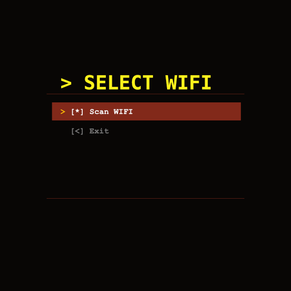
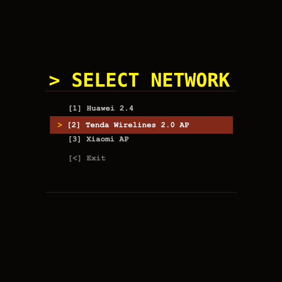
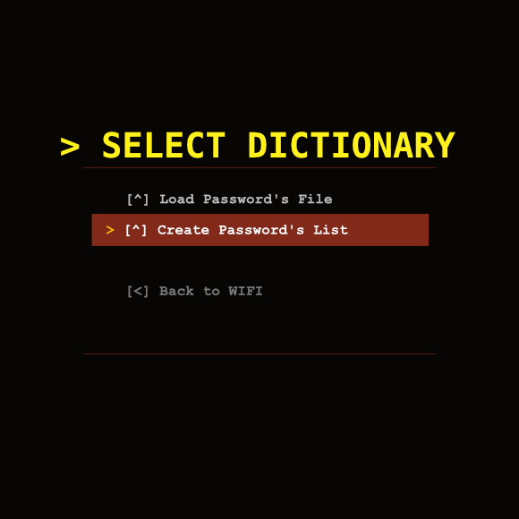
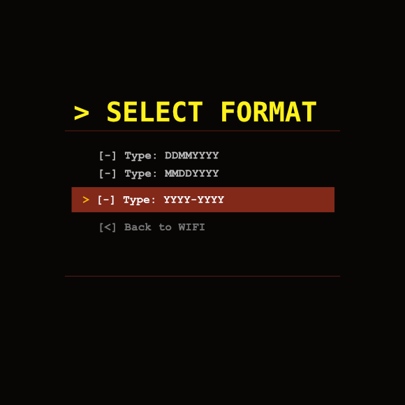
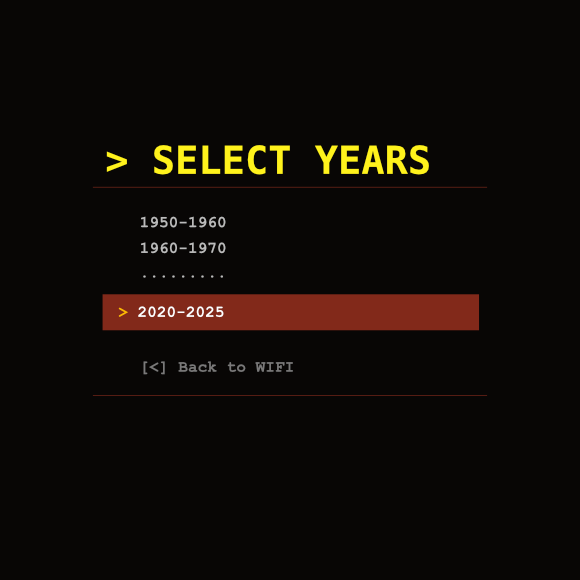
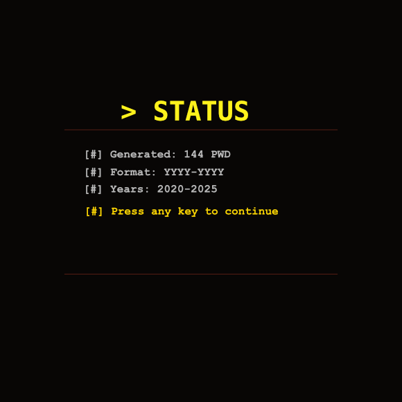
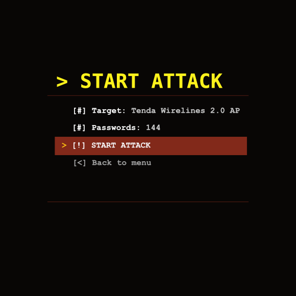
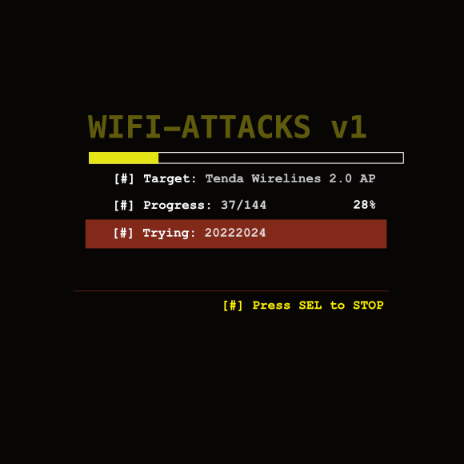

# WiFi BRUT Attacker v1
[English](#english-version) | [Русский](#русская-версия)

## 🖼 Screenshots

### 📱 User Interface Overview

| Main Menu (1) | Network Scan (2) | Dictionary Selection (3) |
|-----------|--------------|---------------------|
|  |  |  |

| Select Format (4) | Select Years (5) | Status (6) |
|-----------------|---------|----------|
|  |  |  |

| Start Attack (7) | Attack Progress (8) | WIFI-Bruts.js (9) |
|------------------|-----------------|-----------------|
|  |  |  |

<a name="english-version">English</a>
## ⚠️ WARNING: FOR EDUCATIONAL AND AUTHORIZED TESTING ONLY
This tool is designed for legal security testing only. Unauthorized use against networks you don't own is illegal. You are solely responsible for how you use this tool. Some devices may implement security measures that could lock you out or trigger alerts when scanned with this tool.

## 📋 Description
A powerful WiFi dictionary attack tool with an intuitive graphical interface, designed for penetration testing and authorized security assessments. The tool systematically tests password combinations against target WiFi networks.

## 🎯 Supported Platforms
🎮 Flipper Zero
* With ESP32 Marauder module (WiFi DevBoard)

🔌 ESP32 Devices
* ESP32-WROOM/WROVER with Marauder firmware
* Standalone ESP32 Marauder devices

📟 ESP8266 Devices
* NodeMCU with Deauther firmware
* Wemos D1 Mini and similar

⚡ Other ESP-based Platforms
* Devices with ESP32-WiFi-Penetration-Tool
* ESPixel and similar projects
* Other platforms with a compatible JavaScript environment and WiFi capabilities

## ✨ Features
## 📡 Network Scanner: 
* Automatically discovers nearby WiFi networks with signal strength indicators

## 📊 Visual Interface: 
* Clean menu system with scrolling support and progress indicators

## 🔑 Multiple Dictionary Sources:
* Load custom password lists from storage
* Generate birthday-based dictionaries with multiple formats (DDMMYYYY, MMDDYYYY, YYYY-YYYY)
* Customizable year ranges (1950-2025)

## 📈 Real-time Progress: 
* Live progress bar with current password attempts

## ⏹️ Attack Control: 
* Stop attacks at any time with button press

## 🔍 Network Filtering: 
* Automatically filters for WPA2-PSK and WEP encrypted networks

## 💾 Serial Logging: 
* All attempts logged to serial for analysis

## 🛠️ Installation & Usage:
1. Load the Script: Deploy the script to your compatible device
2. Select Target: Use the scanner to find target networks
3. Choose Dictionary: Load existing wordlist or generate birthday-based passwords
4. Launch Attack: Monitor progress in real-time
5. Review Results: Successful finds are displayed immediately

## 🎮 Control Scheme:
* UP/DOWN: Navigate menus
* SELECT: Confirm selection
* SELECT (during attack): Stop attack

## 📁 Dictionary Formats:
### Birthday Generator:
1. DDMMYYYY (31011990)
2. MMDDYYYY (01311990)
3. YYYY-YYYY (19902024)
4 Custom Lists:
* Plain text files with one password per line

## ⚠️ Legal Disclaimer:
This software is intended for:
* Security research and education
* Authorized penetration testing
* Testing your own networks
* Legal forensic investigations
* Illegal use is strictly prohibited. The developers are not responsible for any misuse.

## 🔧 Technical Details:
* Implements exponential backoff for connection attempts
* Handles network timeouts gracefully
* Memory-efficient password processing
* Modular design for easy extension

<a name="русская-версия">Русский</a>
## ⚠️ ПРЕДУПРЕЖДЕНИЕ: ТОЛЬКО ДЛЯ ОБРАЗОВАТЕЛЬНЫХ ЦЕЛЕЙ И АВТОРИЗОВАННОГО ТЕСТИРОВАНИЯ
Данный инструмент предназначен только для легального тестирования безопасности. Неавторизованное использование против сетей, которые вам не принадлежат, является незаконным. Вы несете полную ответственность за способ использования этого инструмента. Некоторые устройства могут иметь механизмы безопасности, которые могут заблокировать вас или вызвать предупреждения при сканировании.

## 📋 Описание:
Мощный инструмент для dictionary-атак на WiFi с интуитивно понятным графическим интерфейсом, предназначенный для пентеста и авторизованных проверок безопасности. Инструмент систематически проверяет комбинации паролей для целевых WiFi сетей.

## 🎯 Поддерживаемые платформы:
🎮 Flipper Zero
* С модулем ESP32 Marauder (WiFi DevBoard)

🔌 Устройства ESP32
* ESP32-WROOM/WROVER с прошивкой Marauder
* Автономные устройства ESP32 Marauder

📟 Устройства ESP8266
* NodeMCU с прошивкой Deauther
* Wemos D1 Mini и аналогичные устройства

⚡ Другие платформы на базе ESP
* Устройства с ESP32-инструментом для проникновения Wi-Fi
* ESPixel и аналогичные проекты
* Другие платформы с совместимой JavaScript средой и WiFi возможностями

## ✨ Возможности:
## 📡 Сканер сетей: 
* Автоматически обнаруживает nearby WiFi сети с индикацией силы сигнала

## 📊 Визуальный интерфейс: 
* Чистая система меню с поддержкой прокрутки и индикаторами прогресса

## 🔑 Несколько источников словарей:
* Загрузка пользовательских списков паролей из хранилища
* Генерация словарей на основе дат рождения с несколькими форматами
* Настраиваемые диапазоны годов (1950-2025)

## 📈 Прогресс в реальном времени: 
* Индикатор выполнения с отображением текущих попыток

## ⏹️ Управление атакой: 
* Остановка атаки в любой момент

## 🔍 Фильтрация сетей: 
* Автоматическая фильтрация WPA2-PSK и WEP сетей

## 💾 Логирование: 
* Все попытки логируются в serial для анализа

## 🛠️ Установка и использование:
1. Загрузка скрипта: Разверните скрипт на совместимом устройстве
2. Выбор цели: Используйте сканер для поиска целевых сетей
3. Выбор словаря: Загрузите существующий wordlist или сгенерируйте пароли на основе дат рождения
4. Запуск атаки: Мониторьте прогресс в реальном времени 
5. Просмотр результатов: Найденные пароли отображаются немедленно

## 🎮 Управление
* ВВЕРХ/ВНИЗ: Навигация по меню
* SELECT: Подтверждение выбора
* SELECT (во время атаки): Остановка атаки

## 📁 Форматы словарей
## Генератор по датам рождения:
1.DDMMYYYY (31011990)
2. MMDDYYYY (01311990)
3. YYYY-YYYY (19902024)
4. Пользовательские списки:
* Текстовые файлы с одним паролем на строку

## ⚠️ Юридическое предупреждение
### Данное ПО предназначено для:
* Исследований безопасности и образования
* Авторизованного пентеста
* Тестирования собственных сетей
* Легальных криминалистических расследований
* Незаконное использование строго запрещено. Разработчики не несут ответственности за неправомерное использование.

## 🔧 Технические детали
* Реализовано экспоненциальное backoff для попыток подключения
* Грациозная обработка таймаутов сети
* Эффективная обработка паролей в памяти
* Модульный дизайн для легкого расширения

## 📞 Contact / Контакты
GitHub: @DataSC3

Remember: With great power comes great responsibility. 
* Use this tool wisely and ethically.

Помните: большая сила приходит с большой ответственностью. 
* Используйте этот инструмент мудро и этично.

PS. DataSC3
